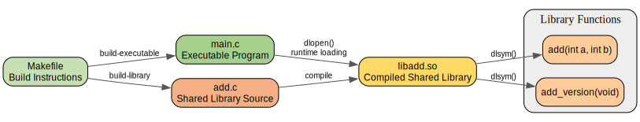

# Shared Library Example

This project demonstrates how to create and use a shared library in C using dynamic loading.

## Project Structure

- [`add.c`](add.c) - Source file containing the shared library functions
- [`main.c`](main.c) - Main program that dynamically loads and uses the shared library
- [`Makefile`](Makefile) - Build commands for the project

### Visual Structure

The project structure can be visualized using the dot file included in this repository.

To generate the diagram:

```bash
dot -Tpng project_structure.dot -o project_structure.png
```

Or to view it in SVG format:

```bash
dot -Tsvg project_structure.dot -o project_structure.svg
```



## Features

- Dynamic loading of a shared library at runtime using `dlopen`
- Function resolution with `dlsym`
- Proper error handling for library loading
- Multiple build configurations

## Functions in the Shared Library

- `int add(int a, int b)` - Adds two integers and returns the result
- `char *add_version(void)` - Returns the current version of the library

## Building the Project

Build the shared library:

```bash
make build-library
```

Build the executable (standard way):

```bash
make build-executable
```

Build the executable with embedded library path:

```bash
make build-executable-with-lib
```

## Running the Program

Run with library path explicitly set:

```bash
make run
```

Or manually:

```bash
LD_LIBRARY_PATH=. ./main
```

## How Dynamic Loading Works

1. The shared library is loaded at runtime using `dlopen("./libadd.so", RTLD_LAZY)`
2. Function pointers are obtained using `dlsym()`
3. After use, the library is unloaded with `dlclose()`

This approach allows for flexible runtime loading of libraries without linking them at compile time.

## Development

To modify the shared library functionality, edit [`add.c`](add.c) and rebuild using `make build-library`.
